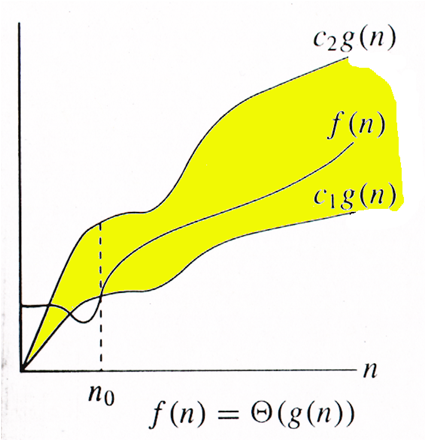
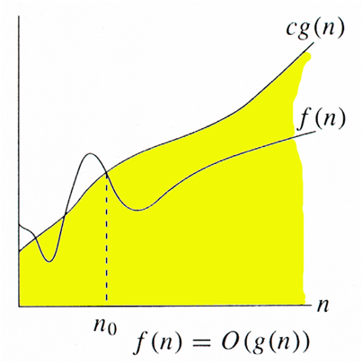
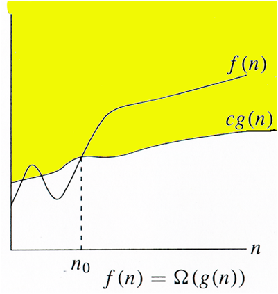
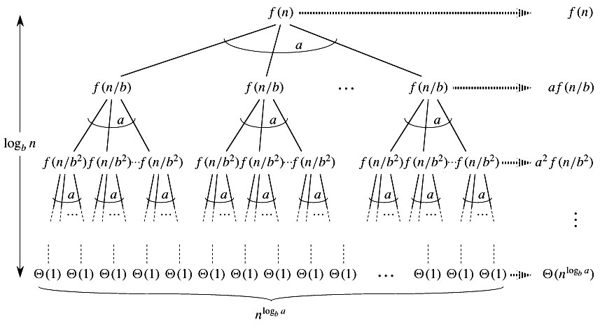

# 算法导论

##  算法分析 | 渐进分析

给出两个任务的算法，我们如何找到哪一个更好?

通常对于我们来说，一个最简单的方法是实现这两种算法，在计算中运行两个程序以获得不同的输入，并查看哪一个花费更少的事件。这种算法分析方法存在很多问题

1. 对于某些输入，第一种算法可能会比第二种算法更好，然而对于另外一种输入，第二种算法可能比第一种算法性能更好
2. 对于一些输入，第一种算法在一台机器上表现更好，而另一种输入则在其他机器上运行的更好

渐进分析就是为了解决上述问题的重要思想。在渐进分析中，我们会根据输入大小来评估算法的性能(我们不测量实际的运行时间)。我们计算算法的时间(或者)空间如何随输入大小而增加。例如，让我们考虑在已排序数组中的搜索问题(搜索给定的项)。搜索的一种方法是线性搜索(增长顺序是线性的)，而另一种是二进制搜索(增长顺序是对数)

为了了解渐近分析如何解决上述分析算法中的问题，现在我们假设在快速计算机上运行线性搜索和在较慢速是计算机上运行二进制搜索。

对于输入数组大小为很小的值的时候，快速计算机可能需要更少的时间。但是，在输入数组大小的某个值之后，即使二进制搜索在慢速计算机上运行，​​二进制搜索很明显地会比线性搜索花费更少的时间。

原因是二进制搜索在输入大小对数方面的增长顺序，而线性搜索的增长顺序是线性的。因此，在输入值的某些值之后，总是可以忽略与机器相关的常量。

## 算法分析 | 最差、平均和最佳

我们可以有三种情况来分析算法：

1. 最差情况
2. 平均情况
3. 最佳情况

示例代码:

    #include <stdio.h>
    
    // Linearly search x in arr[].  If x is present then return the index,
    // otherwise return -1
    int search(int arr[], int n, int x)
    {
        int i;
        for (i=0; i<n; i++)
        {
        if (arr[i] == x)
            return i;
        }
        return -1;
    }
    
    /* Driver program to test above functions*/
    int main()
    {
        int arr[] = {1, 10, 30, 15};
        int x = 30;
        int n = sizeof(arr)/sizeof(arr[0]);
        printf("%d is present at index %d", x, search(arr, n, x));
    
        getchar();
        return 0;
    }　

最坏情况分析(通常完成)

在最坏的情况分析中，我们计算算法运行时间的上限。我们必须知道可以执行最大操作数的情况。在线性搜索，最糟糕的情况就是当要搜索的元素不存在数组中的时候，当x不存在的时候,search函数会将它与arr[]的所有元素逐一比较，因此，线性搜索的最差情况将为Θ(n)

平均情况分析(有时完成)

在平均案例分析中，我们采取所有可能的输入并计算所有输入的计算时间。将所有计算值求和，并将综合除以总输入数。

最佳案例分析

在最佳案例分析中，我们计算算法运行时间的下限。我们必须知道导致执行最少操作数的情况。在线性搜索问题中，当x存在于第一位置时，出现最佳情况。在最佳情况下的操作次数是常数（不依赖于n）。所以在最好的情况下，时间复杂度将是Θ（1）

大多数时候，我们做最坏的情况分析来分析算法。在最差的分析中，我们保证算法运行时间的上限是一个很好的信息。
平均案例分析在大多数实际案例中是不容易的，很少做到。在平均案例分析中，我们必须知道（或预测）所有可能输入的数学分布。
最佳案例分析是假的。确保算法的下限不提供任何信息，如在最坏的情况下，算法可能需要多年才能运行。

对于一些算法，所有情况都是渐近相同的，即没有最差和最好的情况。例如，合并排序。合并排序在所有情况下都执行Θ（nLogn）操作。大多数其他排序算法具有最差和最佳的情况。例如，在快速排序的典型实现（其中将枢轴作为角元素选择）中，最糟糕的情况是当输入数组已经被排序并且当枢轴元素总是将数组分成两半时发生。对于插入排序，最坏情况发生在数组反向排序时，最好的情况发生在数组以与输出相同的顺序排序时。

## 算法分析 | 渐进符号

渐近分析的主要思想是对不依赖与机器特定常数的算法的效率进行测量，并且不需要执行算法和程序进行比较的时间

渐进符号是用于表示渐近分析的算法的时间复杂度的数学工具

1. Θ表示法：Θ符号界定上下一个函数，因此它定义了精确的渐近行为，获取表达式的theta符号的一个简单方法就是降低低阶项，忽略顶点常量

例如考虑下面的表达式

    3n^3 + 6n^2 + 6000 = Θ(n^3)

删除低阶项总是很好，因为不管涉及的常数的情况下，总是会有一个n0,在Θ(n^3)具有比Θ(n^2)更大的值

对于给定的函数g(n),我们表示Θ(g(n))是以下函数的集合

    Θ(g(n)) = {f(n)}:存在正常数c1,c2和n0等，对于所有n>=n0,0 <= c1 * g(n) <= c2 * g(n)

上述定义意味着，如果f(n)是g(n)的Θ，则对于大的n(n>=n0),值f(n)总是在c1 * g(n)和c2 * g(n0).Θ的定义还要求对于n大于n0的值,f(n)必须是非负的

2. 大O表示法：大O表示法定义了算法的上限，它仅从上面界定了一个函数

例如考虑插入排序的情况

在最坏的情况下，在最佳情况和二次时间内需要线性时间。我们可以安全的说，插入排序的时间复杂度是O(n^2)

如果我们使用Θ表示法表示插入排序的时间复杂度，我们必须使用两条语句来实现最佳和最差情况：

- 插入排序的最差时间复杂度为Θ(n^2)
- 插入排序的最佳时间复杂度为Θ(n)

当我们只有一个算法的时间复杂度上限的时候，大O符号是有用的

很多事件，我们很容易找到一个上限，只需要简单的看一下算法

    O(g(n)) = {f(n)} :存在正常常数c和n0,使得 0 <= f(n) <= cg(n),全部n>=n0

3. Ω符号：正如大O表示法在函数上提供渐近上界，Ω表示法提供渐近下界。

当我们对算法的时间复杂度有较低的限制时，可以使用Ω表示法。

如前一篇文章所讨论的，算法的最佳情况一般不是很有用，在这三种渐近符号中，使用的符号最少的就是Ω。

对于给定的函数g（n），我们用Ω（g（n））表示函数集合。

    Ω（g（n））= {f（n））：存在正常常数c和
                    n0，使得0 <= cg（n）<= f（n）
                    所有n> = n0}。

让我们在这里考虑相同的插入排序示例。插入排序的时间复杂度可以写为Ω（n），但它不是关于插入排序的非常有用的信息，因为我们通常对最坏情况感兴趣，有时在平均情况下有兴趣。

## 算法分析 | 循环分析

1. O(1)：如果一个函数(或一组语句)不包含循环，递归和调用任何其它非常数时间函数，则将其视为O(1)的时间复杂度

例如下面循环就是O(1)

        for(int i=1;i<=c;i++){
            //some O(1) expressions
        }

2. O(n):时间如果循环变量递增/递减一个常数，则循环的复杂度被认为是O(n)

        for(int i=1;i<=n;i+=c){
            //some O(1) expressions
        }
        for(int i=n;i>0;i-=c){
            //some O(1) expressions
        }

3. O(n^c):嵌套循环的时间复杂度等于最内层语句的执行次数

例如，一下循环为O(n^2)的时间复杂度

    for(int i=1;i<=n;i+=c){
        for(in j=1;j<=n;j+=c){
            //some O(1) expressions
        }
    }
    for(int i=n;i>0;i+=c){
        for(int j=i+1;j<=n;j+=c){
            //some O(1) expressions
        }
    }

4. O(logn)时间如果循环变量被分割/乘以恒定量，则将循环的复杂度视为O(logn)

        for(int i=1;i<=n;i*=c){
            //some O(1) expressions
        }
        for(int i=n;i>0;i/=c){
            //some O(1) expressions
        }

5. O(loglogn)时间如果循环变量以指数规律减小/增加，则循环的复杂度为O(loglogn)

        // Here c is a constant greater than 1   
        for (int i = 2; i <=n; i = pow(i, c)) { 
            // some O(1) expressions
        }
        //Here fun is sqrt or cuberoot or any other constant root
        for (int i = n; i > 0; i = fun(i)) { 
            // some O(1) expressions
        }

> 如何组合连续循环的时间复杂度？

        for (int i = 1; i <=m; i += c) {  
                // some O(1) expressions
        }
        for (int i = 1; i <=n; i += c) {
                // some O(1) expressions
        }
        Time complexity of above code is O(m) + O(n) which is O(m+n)
        If m == n, the time complexity becomes O(2n) which is O(n). 

## 算法分析 | 递归分析

在前一篇文章中，我们讨论了循环的分析。许多算法本质上是递归的。当我们分析它们时，我们得到时间复杂度的递归关系。我们得到的运行时间是大小为n的输入作为n的函数，以及较小大小的输入的运行时间。

例如在“ 合并排序”中，为了对给定的数组进行排序，我们将其分成两半，并递归地重复两个进程。最后我们合并结果。合并排序的时间复杂度可以写为T（n）= 2T（n / 2）+ cn。还有很多其他算法，如二进制搜索，汉罗塔问题等。

1. 替代方法：猜测解，然后使用数学归纳来证明猜测是正确的或者不正确

        For example consider the recurrence T(n) = 2T(n/2) + n

        We guess the solution as T(n) = O(nLogn). Now we use induction
        to prove our guess.

        We need to prove that T(n) <= cnLogn. We can assume that it is true
        for values smaller than n.

        T(n) = 2T(n/2) + n
            <= cn/2Log(n/2) + n
            =  cnLogn - cnLog2 + n
            =  cnLogn - cn + n
            <= cnLogn

2. 重复树法：在这种方法中，我们绘制一个重复树，并计算每个级别的树所花费的时间。最后，我们总结了各级的工作。为了绘制递推树，我们从给定的复现开始，继续绘制，直到我们在各个层次之间找到一个模式。该图案通常是算术或几何系列

            For example consider the recurrence relation 
            T(n) = T(n/4) + T(n/2) + cn2

                    cn2
                    /      \
                T(n/4)     T(n/2)

            If we further break down the expression T(n/4) and T(n/2), 
            we get following recursion tree.

                            cn2
                    /           \      
                c(n2)/16      c(n2)/4
                /      \          /     \
            T(n/16)     T(n/8)  T(n/8)    T(n/4) 
            Breaking down further gives us following
                            cn2
                        /            \      
                c(n2)/16          c(n2)/4
                /      \            /      \
            c(n2)/256   c(n2)/64  c(n2)/64    c(n2)/16
            /    \      /    \    /    \       /    \  

            To know the value of T(n), we need to calculate sum of tree 
            nodes level by level. If we sum the above tree level by level, 
            we get the following series
            T(n)  = c(n^2 + 5(n^2)/16 + 25(n^2)/256) + ....
            The above series is geometrical progression with ratio 5/16.

            To get an upper bound, we can sum the infinite series. 
            We get the sum as (n2)/(1 - 5/16) which is O(n2)

3. 主方法仅适用于一下类型的复现或可以转化为以下类型的重复

        T(n) = aT(n/b) + f(n) where a >= 1 and b > 1

有以下三种情况：

1. 如果f（n）=Θ（n c）其中c <Log b a    则T（n）=Θ（n Log b a）

2. 如果F（N）=Θ（n c）其中c =Log b a 则T（N）=Θ（NÇlog n）

3. 如果F（N）=Θ（n c）其中c>=Log b a 则T（N）=Θ（f（n））

主方法主要来源于递归树法。如果我们绘制T（n）= aT（n / b）+ f（n）的递归树，我们可以看到在根处完成的是f（n），所有叶子的都是Θ（n c） c是logba。而递归树的高度为Log bn .

在递归树方法中，我们计算完成的总工作量。如果在叶子上完成的工作多数多，那么叶子是主要的部分，我们的结果就成为树叶上（情况1）。

如果在叶子和根部的工作是渐进的，那么我们的结果就变成了高度乘以任何级别的工作（情况2）。

如果在根处完成的工作是更多的，那么我们的结果就会在根上（情况3）。

使用主方法

合并排序：T（n）= 2T（n / 2）+Θ（n）可以评估其时间复杂度的一些标准算法的示例。它属于情况2，其中c=1，Log b a=1.因此解为Θ（n Logn）

二进制搜索：T（n）= T（n / 2）+Θ（1）。它也属于情况2，其中c=0且Log b a=0的情况下出现。因此解为Θ（Logn）

注意：

1）使用主定理可以解决形式T（n）= aT（n / b）+ f（n）的复现。给定的三例在他们之间有一些差距。例如，使用主方法不能求解重复T（n）= 2T（n / 2）+ n / Logn。

2）情况2可以扩展为f（n）=Θ（ncLogkn）
如果f（n）=Θ（ncLogkn）对于一些常数k> = 0，c = Logba，则T（n）=Θ（nc Log k+1 n）

# 链表题

## 1. 链表逆序 LeetCode 206. Reverse Linked List

整体思路:遍历原链表，采用头插法的方式将原链表中的每一个节点插入到新创建的链表中

        //传入一个链表，返回一个逆序的新的链表
        ListNode *reverseList(ListNode *head){
            ListNode *new_head = NULL;
            while(head){
                ListNode *next = head->next;
                head->next = new_head;
                new_head = head;
                head = next;
            }
            return new_head;
        }
## 2. 链表逆序2 LeetCode 92. Reverse Linked List II

整理思路:这次是链表的范围逆序，在给定的范围内逆序链表的一部分.思路是创建两个指针，一个指向逆序范围的开始，一个指向逆序范围的结束，同时逆序完成后要将逆序后的链表再直接跟原链表相连。

要找到四个指针，一个是逆序段头结点的前驱，一个是逆序的头节点，一个是逆序的尾节点，最后一个是逆序段尾节点的后继，找到这四个指针即可利用链表逆序的第一种方法解题

先找头结点，再继续找尾结点，在找尾结点的遍历过程中，通过new_head逆序后，调整了头结点和尾结点的位置，然后再将他们跟前驱和后继连接起来即可。看起来挺复杂，实际上，只要掌握好了思路，给一定的时间就可以完成这道题了

        ListNode* reverseBetween(ListNode*head,int m,int n){
            ListNode *pre_head = NULL;
            ListNode *next_head = NULL;
            ListNode *new_head = NULL;//存放逆序的一段链表
            //你会发现我们无需存储最后的后继，head会遍历到那个位置
            //ListNode *end_head = NULL;
            ListNode *result = head;//存放最终结果的链表
            int change_len = n - m + 1;//步长
            while(head && --m){
                pre_head = head;//逆序的前驱
                head = head->next;
            }
            next_head = head;//指向逆序的头节点
            //下面开始找逆序的尾结点和逆序的后继
            while(head && change_len--){
                //head指向逆序的头结点
                //我们在遍历的同时，进行逆序
                ListNode *next = head->next;
                head->next = new_head;
                new_head = head;
                head = next;
            }
            //逆序完成后,head指向逆序的后继,new_head变成了头节点，那么尾节点
            //自然就是next_head,它从头节点变成了尾节点了
            //最后我们来连接
            next_head->next = head;
            if(pre_head){
                pre_head->next = new_head;
            }else{
                result = new_head;
            }
            return result;
        } 
## 3. 求两个链表的交点   LeetCode 160.Intersection of Two LinkedLists

解题思路:可以利用set集合元素来判断是否有相同的节点，遍历链表A，将A中的节点指针插入set，遍历链表B,将B中的节点地址在set中查找，如果找到，则为交点

        ListNode *geIntersectionNode(ListNode* headA,ListNode* headB){
            std::set<ListNode*> node_set;
            while(headA){
                node_set.insert(headA);
                headA = headA->next;
            }
            while(headB){
                if(node_set.find(headB) != node_set.end()){
                    return headB;
                }
                headB = headB->next;
            }
            return NULL;
        }

## 4.链表求环  LeetCode 142. Linked List Cycle

解题思路:设计两个指针，一个快，每次走两步，一个慢，每次走一步，两个指针如果能够相遇的话，则证明是有环的。并且，从head出发与从相遇的地方出发，两指针速度一样，相遇后即为环的起点

        ListNode *detectCycle(ListNode *head){
            ListNode *fast = head;//快指针
            ListNode *slow = head;//慢指针
            ListNode *meet = NULL;
            while(fast){
                slow = slow->next;
                fast = fast->next;
                if(!fast){
                    return NULL;
                }
                fast = fast->next; //fast再走一步
                if(fast == slow){
                    meet = fast;
                    break;
                }
            }
            if(meet == NULL){
                return NULL;
            }
            while(head && meet){
                if(head == meet){
                    return head;
                }
                head = head->next;
                meet = meet->next;
            }
            return NULL;
        }

## 5. 链表划分 LeetCode 86.Partition List

整理思路:我觉得这个题其实就是送分题，感觉只要把思路理清楚了很容易就可以实现代码，首先，设置两个链表，分别存储小于某个数的节点，再用一个链表存储大于等于某个数的节点，最后再将两个节点连接起来即可。

        ListNode * patition(ListNode* head,int x){
            ListNode less_head(0);
            ListNode more_head(0);
            ListNode *less_ptr = &less_head;
            ListNode *more_ptr = &more_head;
            //注意这里用的是尾插法
            //注意跟头插法的区别
            while(head){
                if(head->val < x){
                    less_ptr->next = head;
                    less_ptr = head;
                }else{
                    more_ptr->next  = head;
                    more_ptr = head;
                }
                head = head->next;
            }
            less_ptr->next = more_head.next;
            more_ptr->next = NULL;
            return less_head.next;
        }

## 6. 合并两个链表  LeetCode 21.Merge Two Sorted Lists

整体思路:合并两个有序的链表思路也简单，两个指针分别遍历两个链表，每遍历一次，比较两个链表节点的值大小，将较小的值先放入最终结果的链表，随后，拥有较小值得链表指针前移，继续跟下一个节点比较，直到比较到链表的末尾，如果这时候有某个链表还每遍历完，则在最后加入到尾部即可

        ListNode *mergeTwoList(ListNode *l1,ListNode *l2){
            ListNode temp_head(0);//临时链表
            ListNode *pre = &temp_head;
            while(l1 && l2){
                if(l1->val < l2->val){
                    //如果第二个链表的值比较大
                    pre->next = l1;
                    l1 = l1->next;
                }else{
                    pre->next = l2;
                    l2 = l2->next;
                }
                pre = pre->next;
            }
            //最后别忘了如果还有链表没有遍历完毕的话
            if(l1){
                pre->next = l1;
            }
            if(l2){
                pre->next = l2;
            }
            return temp_head.next;
        }

## 7. 合并多个链表 LeetCode 23.Merge k Sorted Lists

整体思路:其实如果直接暴力合并的话肯定是超时的，合并多个不能用简单的思维来看，其实方法有很多种，我个人更倾向于最简单的那种，那就是遍历所有的链表，将链表中的元素放入一个容器中进行排序，排序后再变成链表

    ListNode* mergeKLists(std::vector<ListNode*>& lists) {
        std::vector<ListNode *> node_vec;        
        for (int i = 0; i < lists.size(); i++){
        	ListNode *head = lists[i];
        	while(head){
        		node_vec.push_back(head);
	        	head = head->next;
	        }
        }
        if (node_vec.size() == 0){
        	return NULL;
        }        
        std::sort(node_vec.begin(), node_vec.end(), cmp);
        for (int i = 1; i < node_vec.size(); i++){
        	node_vec[i-1]->next = node_vec[i];
        }
        node_vec[node_vec.size()-1]->next = NULL;
        return node_vec[0];
    }

# 栈和队列、堆

## 1. 使用队列的方式实现栈 LeetCode 225.Implement Stack using Queues

整体思路: 我们都知道栈是先进后出，而队列是先进先出，我们可以用两个队列来实现栈，例如新元素暂时放入临时队列去，然后将原队列的内容也push到临时队列中去，然后将临时队列里面的元素push会数据队列即可

## 2. 使用栈的方式实现队列 LeetCode 232.Implement Queue using Stacks

整体思路:跟模拟栈的方式类似，但是有区别，我们要先把原数据栈数据push到临时的栈，再push新的元素，这样新的元素就在栈顶了，之后我们再将temp中的数据push到数据栈中

## 3.包含Min函数的栈 LeetCode 155.MinStack

整体的思路：设计一个函数，能获取栈中最小的值，但是同时也要考虑元素出栈的时候对最小元素的影响。所以，我们专门设计一个栈存储最小值，当有新的元素入栈的时候，我们就跟栈顶元素比较，如果更小，则入栈，如果没有更小，则依然是重复这个最小值入栈以防止元素出栈造成问题

## 4. 求数组中第K大的树  LeetCode 215.Kth Largest Element in an Array

整理的思路:可以使用堆得概念，维护一个K大小的最小堆，堆中元素个数小于k的时候直接入堆，否则，当堆顶小于新元素的时候，弹出堆顶，将新元素加入堆

    int findKthLargest(std::vector<int>& nums, int k) {
        std::priority_queue<int, std::vector<int>, std::greater<int> > Q;
        for (int i = 0; i < nums.size(); i++){
        	if (Q.size() < k){
	        	Q.push(nums[i]);
	        }
	        else if (Q.top() < nums[i]){
        		Q.pop();
	        	Q.push(nums[i]);
	        }
        }
        return Q.top();
    }

# 贪心算法

贪心的核心思想就是:遵循某种规律，不断的贪心的选取当前最优策略的算法设计方法

## 1. 分糖果 LeetCode 455.Assign Cookies

整体思路：两个数组，对需求因子数组g与糖果大小的数组s进行从大到小的排序，按照从小到大得顺序使用各糖果尝试是否可满足某个孩子，每个糖果只尝试一次，若尝试成功，则换下一个孩子尝试，直到发现没有更多的孩子或者没有更多的糖果

        int findContentChildren(std::vector<int> &g,std::vector<int> &s){
            std::sort(g.begin(),g.end());
            std::sort(s.begin(),s.end());
            int child = 0;
            int cookie = 0;
            while(child < g.size() && cookie < s.size()){
                if(g[child] <= s[cookie]){
                    child++;
                }
                cookie++;
            }
            return child;
        }

## 2. 摇摆序列 LeetCode 376.Wiggle Subsequence

整体思路：求数组中满足摇摆序列的最长子序列的长度,核心思想就是如果有持续的递增和递减的情况下选择首尾元素，这样更可能使得尾部的后一个元素成为摇摆子序列的下一个元素

    int wiggleMaxLength(std::vector<int>  &nums){
            if(nums.size() < 2){
                return nums.size();
            }
            static const int BEGIN = 0;
            static const int UP = 1;
            static const int DOWN = 2;
            int STATE = BEGIN;
            int max_length = 1;
            for(int i=1;i<nums.size();i++){
                switch(STATE){
                    case BEGIN: 
                        //说明是上升阶段
                        if(nums[i-1] < nums[i]){
                            STATE = UP;
                            max_length++;
                        }else if(nums[i-1] > nums[i]){
                            STATE = DOWN;
                            max_length++;
                        }
                        break;
                    case UP:
                        if(nums[i-1] > nums[i]){
                            STATE = DOWN;
                            max_length++;
                        }
                        break;
                    case DOWN: 
                        if(nums[i-1] < nums[i]){
                            STATE = UP;
                            max_length++;
                        }
                        break;    
                }
            }
            return max_length;
        }

## 3. 移除K个数字 LeetCode 402.Remove K Digits

整理思路：移除K个数字后，可以得到最小的数，依次遍历每一个数字，查看每个数字的大小，如果对应的数字大于下一个数字的话，我们就可以考虑将它去掉，则得到的数字最小了

这个题的核心是 找到数字中较大的数字将它从中去除，留下的就是最小的,但是要遵循从高位到低位的顺序去除，不能随便去，例如从末尾开始去就不行了，除非是数字是一种递增的情况  98765去除一个数字，肯定是去除9，如果是56789肯定是去除9最大了，是吧

    std::string removeKdigits(std::string num, int k) {
    	std::vector<int> S;
    	std::string result = "";
        //遍历整个字符串中的每一个数字
    	for (int i = 0; i < num.length(); i++){
	    	int number = num[i] - '0';
            //用每一个数字跟栈顶的数字进行比较
            //如果栈顶大于这个数字，则让栈顶元素出栈
	    	while(S.size() != 0 && S[S.size()-1] > number && k > 0){
	    		S.pop_back();
	    		k--;
	    	}
            //否则的话，我们在栈不空的情况下将字符串中的每个数字压入栈
	    	if (number != 0 || S.size() != 0){
	    		S.push_back(number);
	    	}
	    }
        //当去除的数字不符合条件的时候，我们直接删除栈顶的元素即可
        // 例如12345这种,都不符合条件，直接删除尾部的即可
	    while(S.size() != 0 && k > 0){
    		S.pop_back();
    		k--;
    	}
	    for (int i = 0; i < S.size(); i++){
    		result.append(1, '0' + S[i]);
    	}
    	if (result == ""){
	    	result = "0";
	    }
    	return result;
    }

## 4. 跳跃游戏 LeetCode 55.Jump Game

整理思路：一个数组，从第一个元素开始跳跃最多a[0]步，判断是否可以跳跃到最后一个元素?
稍微难点的是最多这个概念，也就是说它可以在这个a[0]值得区间进行自由的选择，跳哪个都可以，只要能够满足跳跃到数组的末尾即可。

我们要用一个max_index来记录在每次跳跃中它能跳跃的最大的值，然后遍历整个数组，如果当中出现更大的数就更新max_index的值，通过每跳跃一步就jump++,如果jump > max_index的值了证明我们就无法再跳跃了，否则直到jump == 数组的末尾

    bool canJump(std::vector<int>& nums) {
        std::vector<int> index;
        //记录每个数组位置能跳的最远的距离
        //实际是跳跃的数组的下标位置
        for (int i = 0; i < nums.size(); i++){
        	index.push_back(i + nums[i]);
        }
        int jump = 0;
        int max_index = index[0];
        //如果发现有更大的数字，则更新max_index的值
        while(jump < index.size() && jump <= max_index){
        	if (max_index < index[jump]){
	        	max_index = index[jump];
	        }
        	jump++;
        }
        //跳到最后了
        if (jump == index.size()){
        	return true;
        }
        return false;
    }

## 5.跳跃游戏2  LeetCode 45.Jump Game II

整体思路：确认了可以跳过去，但是求最少跳跃的次数，这次比上次稍微有点复杂了.最少的意义就是什么时候跳最合适了，在一次可跳跃的范围内，找到最远的跳跃距离则跳跃，如果在这个时候没有找到，就只能强制跳跃了

    int jump(std::vector<int>& nums) {
    	if (nums.size() < 2){
	    	return 0;
	    }
        int current_max_index = nums[0];//当前可跳跃的最远距离
        int pre_max_max_index = nums[0];//遍历各个位置的时候可以达到的最大的距离
        int jump_min = 1;
        for (int i = 1; i < nums.size(); i++){
        	if (i > current_max_index){
        		jump_min++;
	        	current_max_index = pre_max_max_index;
	        }
            //如果在遍历过程中发现更大的跳跃距离，则更新pre_max_max_index的值
        	if (pre_max_max_index < nums[i] + i){
       			pre_max_max_index = nums[i] + i;
        	}
        }
        return jump_min;
    }

# 递归和回溯、分治

## 1. 求子集的问题 LeetCode 78. Subsets

解题思路:在所有的子集中，生成各个子集，难点在于选与不选。对于每一个元素，都有放入和不放入两个选择,选择放入该元素，完成后续元素的试探;这时候再选择不放入元素，完成后续元素的试探即可。这里要用到递归的概念，使用递归完成回溯的操作

        class Solution {
            public: 
                std::vector<std::vector<int> > subsets(std::vector<int>& nums){
                    std::vector<std::vector<int> > result; //存放最终结果的数组
                    std::vector<int> item; //回溯的时候产生各个子集的数组
                    result.push_back(item);
                    generate(0,nums,item,result);
                    return result;
                }
            private: 
                void generate(int i,std::vector<int>& nums,
                std::vector<int>& item,std::vector<std::vector<int> >& result
                ){
                    if(i >= nums.size()){
                        return;
                    }
                    item.push_back(nums[i]);
                    result.push_back(item);
                    generate(i+1,nums,item,result);
                    item.pop_back();
                    generate(i+1,nums,item,result);
                }
        };

## 2.生成括号   LeetCode 22. Generate Parentheses

整体思路:生成括号的可能性都要考虑，这道题可以借鉴第一题的思想，既然我们是要求得所有括号的可能性。左括号与右括号一起放，数量上不能超过N,每放一个左括号，才可以放一个右括号即右括号不可先于左括号放

在递归的时候添加一些限制条件即可将结果求出

    class Solution {
        public: 
            std::vector<std::string> generateParenthesis(int n){
                std::vector<std::string> result;
                generate("",n,n,result);
                return result;
            }
        private: 
            void generate(std::string item,int left,int right,std::vector<std::string> &result){
                if(left == 0 && right == 0){
                    result.push_back(item);
                    return;
                }
                if(left > 0){
                    generate(item+'(',left-1,right,result);
                }
                if(left < right){
                    generate(item+')',left,right-1,result);
                }
            }    
    };

# 二叉树

## 1.路径之和 LeetCode 113.Path Sum II

整体思路:从根节点开始深度遍历二叉树，先序遍历的时候，将节点的值存储入栈，并累加值。当遍历到叶子节点的时候，检查值是否等于sum

再后续遍历的时候，将该节点的值从栈中弹出，path_value也减去相应的节点的值

    class Solution {
        public:
            std::vector<std::vector<int> > pathSum(TreeNode* root, int sum) {
                std::vector<std::vector<int> > result;
                std::vector<int> path;
                int path_value = 0;
                preorder(root, path_value, sum, path, result);
                return result;
            }
        private:
            void preorder(TreeNode *node, int &path_value, int sum,
                        std::vector<int> &path,
                        std::vector<std::vector<int> > &result){
                if (!node){
                    return;
                }
                //刚访问这个节点的时候
                path_value += node->val;
                path.push_back(node->val);
                if (!node->left && !node->right && path_value == sum){
                    result.push_back(path);
                }
                preorder(node->left, path_value, sum, path, result);
                //每次遍历完它的左子树的时候
                preorder(node->right, path_value, sum, path, result);
                //深度遍历完左右子树后回归到本节点本身的时候，再将本节点删除，依次类推
                path_value -= node->val;
                path.pop_back();
            }
    };

## 2.最近的公共祖先 LeetCode 236.Lowest Common Ancestor of a Binary Tree

整理思路:求p节点路径，求q节点路径，两条路径中最后一个相同的节点就是公共祖先了

## 3. 二叉树转链表 LeetCode 114.Flatten Binary Tree to Linked List(solve1)

整理思路:非常的简单，将二叉树的节点放入容器中，然后再相连

    class Solution {
        public:
            void flatten(TreeNode *root) {
                std::vector<TreeNode *> node_vec;
                preorder(root, node_vec);
                for (int i = 1; i < node_vec.size(); i++){
                    node_vec[i-1]->left = NULL;
                    node_vec[i-1]->right = node_vec[i];
                }
            }
        private:
            void preorder(TreeNode *node, std::vector<TreeNode *> &node_vec){
                if (!node){
                    return;
                }
                node_vec.push_back(node);
                preorder(node->left, node_vec);
                preorder(node->right, node_vec);
            }
    };

# 二叉排序树与二分查找

二分查找算法的思想:二分查找，首先假设表中元素是按照升序排列的，将表中间位置的关键字与查找的关键字进行比较，如果两者相等，则查找成功，否则利用中间位置将表分为前后两个字表，重复以上过程....

    bool binary_search(std::vector<int> &sort_array,
                    int begin, int end, int target){
        if (begin > end){
            return false;
        }
        int mid = (begin + end) / 2;
        if (target == sort_array[mid]){
            return true;
        }
        else if (target < sort_array[mid]){
            return binary_search(sort_array, begin, mid-1, target);
        }
        else if (target > sort_array[mid]){
            return binary_search(sort_array, mid + 1, end, target);
        }
    }

## 1. 插入位置 LeetCode 35.Search Insert Position

整体思路:利用二分查找的方式去查找元素，如果找到的话则返回target所在的下标，如果target未出现则返回target应该插入位置的数组下标

    int searchInsert(std::vector<int>& nums, int target) {
            int index = -1;
            int begin = 0;
            int end = nums.size() - 1;
            while (index == -1){
                int mid = (begin + end) / 2;
                if (target == nums[mid]){
                    index = mid;
                }
                else if (target < nums[mid]){
                    if (mid == 0 || target > nums[mid - 1]){
                        index = mid;
                    }
                    end = mid - 1;
                }
                else if (target > nums[mid]){
                    if (mid == nums.size() - 1 || target < nums[mid + 1]){
                        index = mid + 1;
                    }
                    begin = mid + 1;
                }
            }
            return index;
        }

## 2. 区间查找 LeetCode 34.Search for a Range

    int left_bound(std::vector<int>& nums, int target){
        int begin = 0;
        int end = nums.size() - 1;
        while(begin <= end){
            int mid = (begin + end) / 2;
            if (target == nums[mid]){
                if (mid == 0 || nums[mid -1] < target){
                    return mid;
                }
                end = mid - 1;
            }
            else if (target < nums[mid]){
                end = mid - 1;
            }
            else if (target > nums[mid]){
                begin = mid + 1;
            }
        }
        return -1;
    }

    int right_bound(std::vector<int>& nums, int target){
        int begin = 0;
        int end = nums.size() - 1;
        while(begin <= end){
            int mid = (begin + end) / 2;
            if (target == nums[mid]){
                if (mid == nums.size() - 1 || nums[mid + 1] > target){
                    return mid;
                }
                begin = mid + 1;
            }
            else if (target < nums[mid]){
                end = mid - 1;
            }
            else if (target > nums[mid]){
                begin = mid + 1;
            }
        }
        return -1;
    }

## 3. 旋转数组查找 LeetCode 33.Search in Rotated Sorted Array

    int search(std::vector<int>& nums, int target) {
            int begin = 0;
            int end = nums.size() - 1;
            while(begin <= end){
                int mid = (begin + end) / 2;
                if (target == nums[mid]){
                    return mid;
                }
                else if (target < nums[mid]){
                    if (nums[begin] < nums[mid]){
                        if (target >= nums[begin]){
                            end = mid - 1;
                        }
                        else{
                            begin = mid + 1;
                        }
                    }
                    else if (nums[begin] > nums[mid]){
                        end = mid -1;
                    }
                    else if (nums[begin] == nums[mid]){
                        begin = mid + 1;
                    }
                }
                else if (target > nums[mid]){
                    if (nums[begin] < nums[mid]){
                        begin = mid + 1;
                    }
                    else if (nums[begin] > nums[mid]){
                        if (target >= nums[begin]){
                            end = mid - 1;
                        }
                        else{
                            begin = mid + 1;
                        }
                    }
                    else if (nums[begin] == nums[mid]){
                        begin = mid + 1;
                    }
                }
            }
            return -1;
        }

# 哈希与字符串

## 1. 最长回文串 LeetCode 409.Longest Palindrome

    int longestPalindrome(std::string s) {
            int char_map[128] = {0};
            int max_length = 0;
            int flag = 0;
            for (int i = 0; i < s.length(); i++){
                char_map[s[i]]++;
            }
            for (int i = 0; i < 128; i++){
                if (char_map[i] % 2 == 0){
                    max_length += char_map[i];
                }
                else{
                    max_length += char_map[i] - 1;
                    flag = 1;
                }
            }
            return max_length + flag;
    }

## 2. 词语模式  LeetCode 290.Word Pattern

    bool wordPattern(std::string pattern, std::string str) {
            std::map<std::string, char> word_map;
            char used[128] = {0};
            std::string word;
            int pos = 0;
            str.push_back(' ');
            for (int i = 0; i < str.length(); i++){
                if (str[i] == ' '){
                    if (pos == pattern.length()){
                        return false;
                    }
                    if (word_map.find(word) == word_map.end()){
                        if (used[pattern[pos]]){
                            return false;
                        }
                        word_map[word] = pattern[pos];
                        used[pattern[pos]] = 1;
                    }
                    else{
                        if (word_map[word] != pattern[pos]){
                            return false;
                        }
                    }
                    word = "";
                    pos++;
                }
                else{
                    word += str[i];
                }
            }
            if (pos != pattern.length()){
                return false;
            }
            return true;
    }

## 3. 同字符词语分组  LeetCode 49.Group Anagrams

    std::vector<std::vector<std::string> > groupAnagrams(
                std::vector<std::string>& strs) {
            std::map<std::string, std::vector<std::string> > anagram;
            std::vector<std::vector<std::string> > result;		
            for (int i = 0; i < strs.size(); i++){
                std::string str = strs[i];
                std::sort(str.begin(), str.end());
                if (anagram.find(str) == anagram.end()){
                    std::vector<std::string> item;
                    anagram[str] = item;
                }
                anagram[str].push_back(strs[i]);
            }
            std::map<std::string, std::vector<std::string> > ::iterator it;
            for (it = anagram.begin(); it != anagram.end(); it++){
                result.push_back((*it).second);
            }
            return result;
    }

## 4. 无重复字符的最长子串  LeetCode 3.Longest Substring Without Repeating Characters

    int lengthOfLongestSubstring(std::string s) {
            int begin = 0;
            int result = 0;
            std::string word = "";
            int char_map[128] = {0};
            for (int i = 0; i < s.length(); i++){
                char_map[s[i]]++;
                if (char_map[s[i]] == 1){
                    word += s[i];
                    if (result < word.length()){
                        result = word.length();
                    }
                }
                else{
                    while(begin < i && char_map[s[i]] > 1){
                        //将hash中记录的之前的字符串出现的次数全部减1是为了重新统计
                        char_map[s[begin]]--;//这个不是很明白？
                        begin++;
                    }
                    word = "";
                    for (int j = begin; j <= i; j++){
                        word += s[j];
                    }
                }
            }
            return result;
    }

## 5. 最小窗口子串 LeetCode 76. Minimum Window Substring

    class Solution {
    private:
        bool is_window_ok(int map_s[], int map_t[], std::vector<int> &vec_t){
            for (int i = 0; i < vec_t.size(); i++){
                if (map_s[vec_t[i]] < map_t[vec_t[i]]){
                    return false;
                }
            }
            return true;
        }
    public:
        std::string minWindow(std::string s, std::string t) {
            const int MAX_ARRAY_LEN = 128;
            int map_t[MAX_ARRAY_LEN] = {0};
            int map_s[MAX_ARRAY_LEN] = {0};
            std::vector<int> vec_t;
            for (int i = 0; i < t.length(); i++){
                map_t[t[i]]++;
            }
            for (int i = 0; i < MAX_ARRAY_LEN; i++){
                if (map_t[i] > 0){
                    vec_t.push_back(i);
                }
            }
            
            int window_begin = 0;
            std::string result;
            for (int i = 0; i < s.length(); i++){
                map_s[s[i]]++;
                while(window_begin < i){
                    char begin_ch = s[window_begin];
                    if (map_t[begin_ch] == 0){
                        window_begin++;
                    }
                    else if	(map_s[begin_ch] > map_t[begin_ch]){
                        map_s[begin_ch]--;
                        window_begin++;
                    }
                    else{
                        break;
                    }
                }
                if (is_window_ok(map_s, map_t, vec_t)){
                    int new_window_len = i - window_begin + 1;
                    if (result == "" || result.length() > new_window_len){
                        result = s.substr(window_begin, new_window_len);
                    }
                }
            }
            return result;
        }
    };

# 动态规划

## 1. 爬楼梯 LeetCode 70.Climbing Stairs

        int climbStairs(int n ){
            std::vector<int> dp(n+3,0);
            dp[0] = 1;
            dp[1] = 2;
            for(int i=3;i<=n;i++){
                dp[i] = dp[i-1] + dp[i-2];
            }
            return dp[n];
        }
这道题的解决方案就是第i阶楼梯的数量 = i-1的数量 + i-2的数量

## 2. 打家劫舍 LeetCode 198.House Robber

整体思路:这次走的步数就不是固定的1步或者两步了，至少要走2步或者是大于2步，如果获取的值是最大的

        int rob(std::vector<int> &nums){
            if(nums.size() == 0){
                return 0;
            }
            if(nums.size() == 1){
                return nums[0];
            }
            std::vector<int> dp(nums.size(),0);
            dp[0] = nums[0];
            dp[1] = std::max(nums[0],nums[1]);
            for(int i=2;i<nums.size();i++){
                dp[i] = std::max(dp[i-1],dp[i-2] + nums[i]);
            }
            return dp[nums.size()-1];
        }

## 3. 最大字段和 LeetCode 53.Maximum Subarray

解题思路:将求n个数的数字的最大字段和，转换成分别求出第1个、第2个、第i个、第n个数字结尾的最大字段和，再找出这n个结果中最大的即可为结果

    int maxSubArray(std::vector<int>& nums) {
    	std::vector<int> dp(nums.size(), 0);
    	dp[0] = nums[0];
    	int max_res = dp[0];
    	for (int i = 1; i < nums.size(); i++){
	    	dp[i] = std::max(dp[i-1] + nums[i], nums[i]);
	    	if (max_res < dp[i]){
	    		max_res = dp[i];
	    	}
	    }
        return max_res;
    }

## 4. 找零钱

## 5. 三角形

## 6. 最长上升子序列

## 7. 最小路径和

